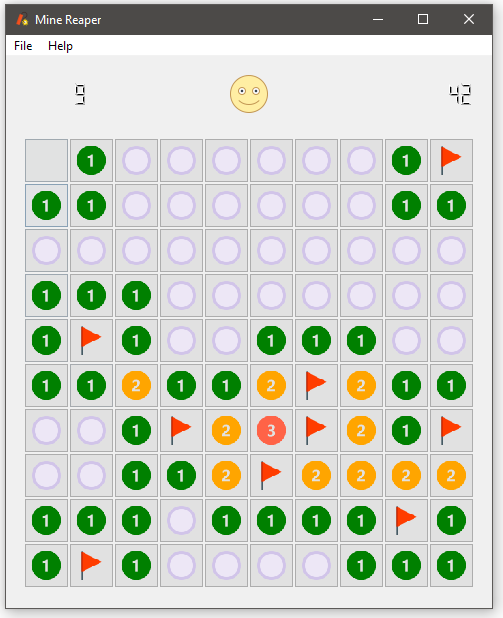

# Mine Reaper
This is quite a simple game, that almost everybody is familiar with.

This one is my attempt of recreating this classic game, inspired by Martin Fitzpatrick and his [**Moonsweeper**](https://leanpub.com/create-simple-gui-applications).

### Rules are simple:  
There are several mines on a field, and your target is to find them all _**without** triggering explosion_.  
Each cell may contain mine; being neighboured by one or more mines or be empty and having no mines around it.  
Left-click cell to reveal its status, right-click to mark cell as a mine.

#### There are 3 difficulty levels:
- **Easy** - 10x10 field with 10 mines
- **Medium** - 12x12 field with 20 mines
- **Hard** - 15x15 field with 30 mines
